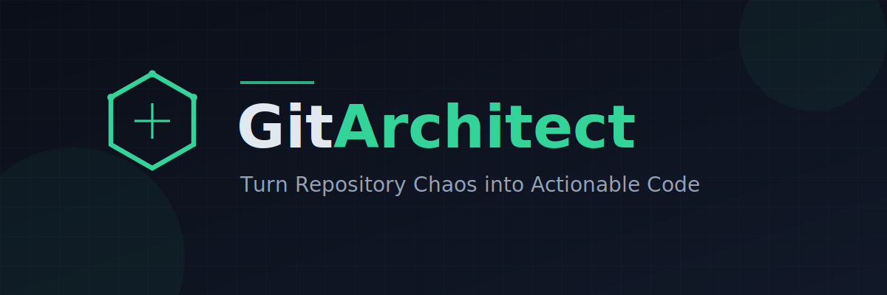

# GitArchitect



**GitArchitect** is an intelligent repository analysis tool that transforms codebase chaos into clear, actionable developer implementation plans. By bridging the gap between high-level goals and existing code structures, it generates precise `TODO.md` files that serve as battle plans for complex refactors, feature additions, or architectural overhauls.

## 🚀 Features

- **Context-Aware Analysis**: Automatically imports and analyzes GitHub repository structure and documentation to understand your specific tech stack.
- **Intelligent Planning**: Generates step-by-step implementation guides with complexity estimates, rationale, and specific file targets.
- **Interactive Consultation**: Chat with the planner about specific steps to get code snippets, clarification, or alternative approaches.
- **Exportable Plans**: One-click download of generated plans as formatted Markdown files.
- **Privacy Focused**: Runs entirely in the browser; your API key is used directly to communicate with the AI provider.

## 🛠️ Tech Stack

- **Frontend**: React 19, TailwindCSS, Lucide Icons
- **AI Integration**: Google GenAI SDK (Default Adapter)
- **Styling**: JetBrains Mono & Inter typography

## 🏁 Getting Started

### Prerequisites

- Node.js (v18 or higher)
- npm or yarn
- An AI Provider API Key (See Configuration)

### Installation

1. **Clone the repository**
   ```bash
   git clone https://github.com/yourusername/git-architect.git
   cd git-architect
   ```

2. **Install dependencies**
   ```bash
   npm install
   ```

3. **Start the development server**
   ```bash
   npm start
   ```

## 🔑 Configuration

GitArchitect requires a Generative AI API Key to perform code analysis.

The application uses a service adapter pattern in `services/gemini.ts`. While the default configuration is optimized for **Google's Gemini 2.5 Flash** (due to its large context window and speed), the application can be adapted to support other providers (OpenAI, Anthropic) by modifying the service layer.

### Setting up the Environment

To run the application, you must provide your API Key via an environment variable or build configuration.

**For local development:**

Ensure `process.env.API_KEY` is available.
*   If using a bundler like Vite/Webpack, create a `.env` file:
    ```env
    API_KEY=your_api_key_here
    ```

> **Note:** The current release expects a key compatible with the Google GenAI SDK. You can obtain one from [Google AI Studio](https://aistudio.google.com/).

## 📖 Usage

1. **Search**: Enter a GitHub repository name (e.g., `facebook/react`) in the search bar.
2. **Define Goal**: Explain what you want to achieve (e.g., "Migrate this component to functional hooks").
3. **Contextualize**: Describe any known issues or constraints.
4. **Generate**: Review the step-by-step plan.
5. **Interact**: Click the "Ask about this step" button to get specific code examples for a task.
6. **Download**: Export the plan as a `TODO.md` for your project.

## 🤝 Contributing

Contributions are welcome! Please feel free to submit a Pull Request.

1. Fork the project
2. Create your feature branch (`git checkout -b feature/AmazingFeature`)
3. Commit your changes (`git commit -m 'Add some AmazingFeature'`)
4. Push to the branch (`git push origin feature/AmazingFeature`)
5. Open a Pull Request

## 📄 License

Distributed under the MIT License. See `LICENSE` for more information.